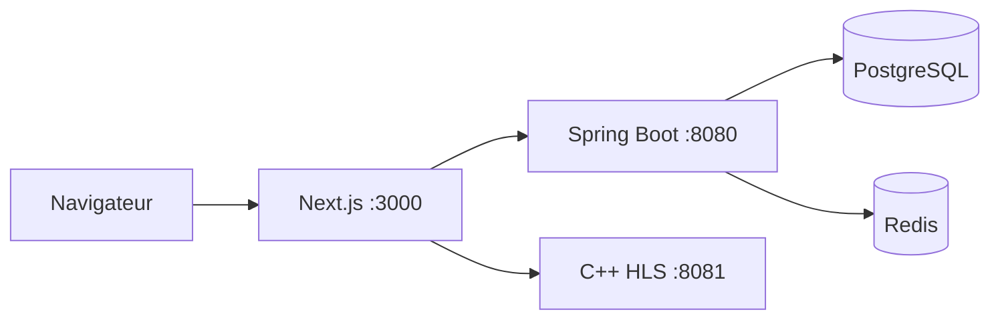

# Netflix Clone

Plateforme de streaming de démonstration composée d’un frontend Next.js, d’une API Spring Boot et d’un serveur HLS C++ dédié.

> Ce dépôt est un projet de portfolio, pas un service de paiement ou de diffusion prêt pour la production. L’activation des forfaits est un mode de démonstration explicite et désactivé par défaut dans l’application.

## Stack

- Next.js 16, React 19, TypeScript, Tailwind CSS et hls.js
- Spring Boot 3.5, Java 21, Spring Security, JPA et Flyway
- PostgreSQL 16 et Redis 7
- C++20, OpenSSL, jwt-cpp, pool de workers borné et `sendfile`
- Docker Compose et GitHub Actions

## Architecture

Le navigateur ne contacte que Next.js sur le port `3000`. Les ports PostgreSQL, Redis, API et streaming restent internes au réseau Compose.



Redis est utilisé comme cache et comme stockage des sessions de refresh tokens. PostgreSQL reste la source d’autorité pour les comptes, profils, abonnements et films.

## Sécurité implémentée

- cookies d’authentification `HttpOnly`, `SameSite=Lax` et `Secure` en HTTPS ;
- protection CSRF par cookie et en-tête `X-XSRF-TOKEN` ;
- access tokens et refresh tokens RSA distincts par claim ;
- refresh tokens à usage unique, identifiés par `jti`, stockés et consommés dans Redis ;
- révocation de la session refresh au logout ;
- limitation atomique des tentatives de connexion et de génération de tickets via Redis ;
- contrôle de propriété du profil sur la watchlist et l’historique ;
- validation de l’abonnement en PostgreSQL avec cache Redis à durée limitée ;
- clés RSA séparées pour l’authentification et les tickets de streaming ;
- ticket limité à un dossier vidéo présent dans le catalogue ;
- chemins vidéo canoniques, requêtes bornées, timeouts, `Range` HTTP et manifests HLS réécrits avec le ticket ;
- migrations Flyway, contraintes SQL et index explicites.

## Démarrage local

Prérequis : Docker avec le plugin Compose, OpenSSL et FFmpeg si vous devez générer les médias HLS.

```bash
cp .env.example .env
mkdir -p infra/secrets streaming/videos

openssl genpkey -algorithm RSA -pkeyopt rsa_keygen_bits:2048 \
  -out infra/secrets/auth-private.pem
openssl rsa -pubout -in infra/secrets/auth-private.pem \
  -out infra/secrets/auth-public.pem

openssl genpkey -algorithm RSA -pkeyopt rsa_keygen_bits:2048 \
  -out infra/secrets/streaming-private.pem
openssl rsa -pubout -in infra/secrets/streaming-private.pem \
  -out infra/secrets/streaming-public.pem
```

Ajoutez ensuite les médias correspondant au catalogue de démonstration dans
`backend/src/main/resources/db/demo/R__demo_catalog.sql`. Exemple pour le dossier `sintel` :

```bash
mkdir -p streaming/videos/sintel
ffmpeg -i sintel.mp4 \
  -codec:v libx264 -codec:a aac \
  -hls_time 6 -hls_playlist_type vod \
  -hls_segment_filename 'streaming/videos/sintel/segment_%03d.ts' \
  streaming/videos/sintel/playlist.m3u8
```

Lancez les cinq conteneurs :

```bash
docker compose up --build
```

L’application est disponible sur [http://localhost:3000](http://localhost:3000). Inscrivez un compte, créez un profil puis activez un forfait de démonstration. Aucun paiement réel n’est effectué.

## Configuration

Les principales variables sont documentées dans `.env.example` :

| Variable | Rôle | Valeur locale |
|---|---|---|
| `DB_PASSWORD` | mot de passe PostgreSQL obligatoire | à définir |
| `REDIS_PASSWORD` | mot de passe Redis obligatoire | à définir |
| `SPRING_PROFILES_ACTIVE` | charge le catalogue Flyway avec le profil `demo` | `demo` |
| `SUBSCRIPTION_DEMO_ACTIVATION_ENABLED` | autorise l’activation sans paiement | `true` en local |
| `COOKIE_SECURE` | impose HTTPS aux cookies d’auth | `false` en HTTP local |
| `CORS_ALLOWED_ORIGINS` | origines frontend autorisées, séparées par des virgules | `http://localhost:3000` |
| `JWT_ACCESS_EXPIRATION` | durée access token en ms | `900000` |
| `JWT_REFRESH_EXPIRATION` | durée refresh token en ms | `604800000` |

Pour un déploiement réel, retirez le profil `demo`, désactivez l’activation de démonstration, activez
`COOKIE_SECURE`, renseignez l’origine HTTPS publique dans `CORS_ALLOWED_ORIGINS` et connectez un prestataire
de paiement avec validation par webhook.

## API principale

Toutes les routes, sauf inscription, connexion, refresh, CSRF et healthcheck, exigent une authentification.

| Méthode | Route | Description |
|---|---|---|
| `GET` | `/api/v1/auth/csrf` | initialise le token CSRF |
| `POST` | `/api/v1/auth/register` | crée un compte |
| `POST` | `/api/v1/auth/login` | crée les cookies access/refresh |
| `POST` | `/api/v1/auth/refresh` | consomme et renouvelle la session refresh |
| `POST` | `/api/v1/auth/logout` | révoque la session et efface les cookies |
| `GET/POST` | `/api/v1/profiles` | liste ou crée un profil |
| `PUT/DELETE` | `/api/v1/profiles/{id}` | modifie ou supprime un profil |
| `GET/POST/DELETE` | `/api/v1/watchlist/{movieId}` | gère la liste du profil actif |
| `GET/POST` | `/api/v1/watch-history` | lit ou sauvegarde la progression |
| `GET` | `/api/v1/movies/search` | recherche bornée par texte et genre |
| `GET` | `/api/v1/stream/{videoFolder}/ticket` | émet un ticket HLS pour un abonné actif |
| `GET` | `/api/v1/health` | vérifie PostgreSQL et Redis |

Les routes liées au profil exigent l’en-tête `X-Profile-Id`. Le backend vérifie systématiquement que ce profil appartient au compte authentifié.

## Tests et CI

```bash
cd frontend
npm ci
npm run lint
npm run build

cd ../backend
./mvnw test

cd ../streaming
cmake -S . -B build
cmake --build build
ctest --test-dir build --output-on-failure
```

Les workflows GitHub Actions s’exécutent sur les pushes et les pull requests pour le frontend, le backend, le moteur C++ et la configuration Compose.

## Arborescence utile

```text
backend/                  API Spring Boot, migrations et tests
frontend/                 application Next.js
streaming/src/            serveur HLS C++
streaming/tests/          tests C++
streaming/videos/         médias locaux ignorés par Git
infra/secrets/            clés locales ignorées par Git
docker-compose.yml        orchestration des cinq services
.github/workflows/        CI par composant
```

## Limites assumées

- aucun paiement réel ;
- aucun DRM ni transcodage à la volée ;
- aucun média vidéo versionné dans Git ;
- pas encore de moteur de recommandation ;
- le serveur C++ utilise un pool de workers borné, pas HTTP/2.
