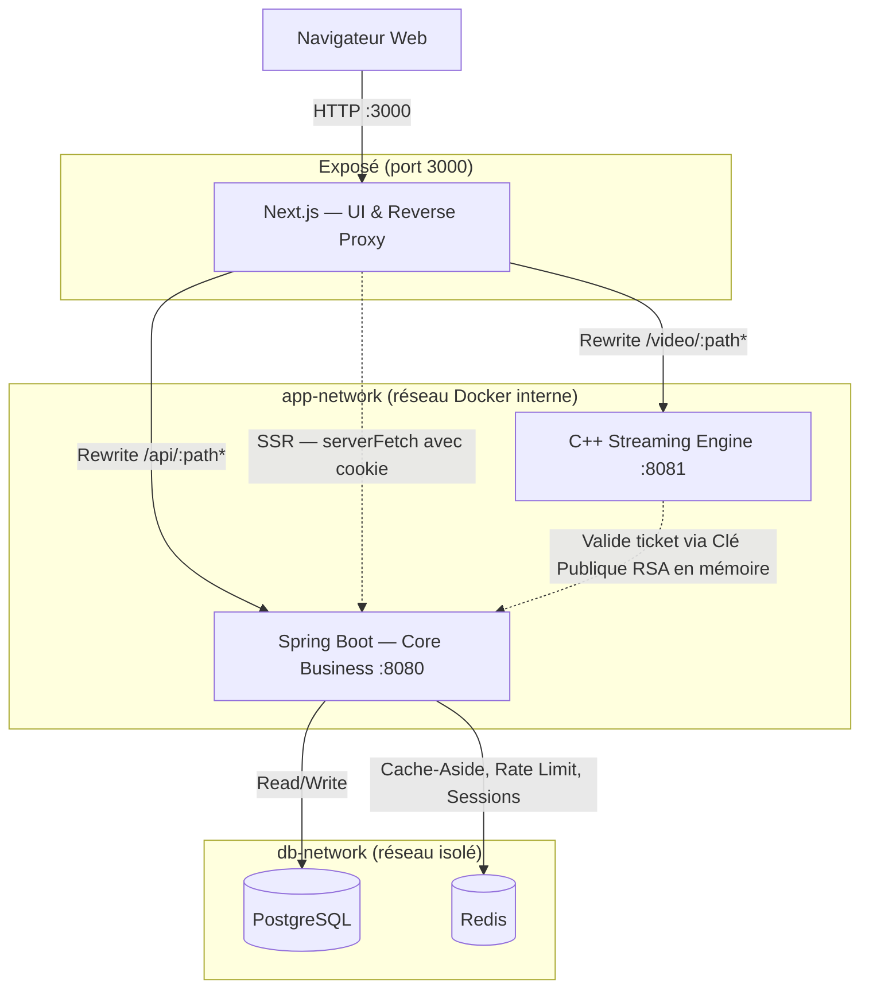
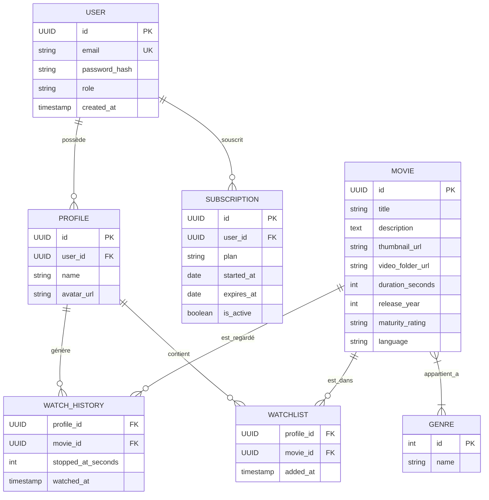
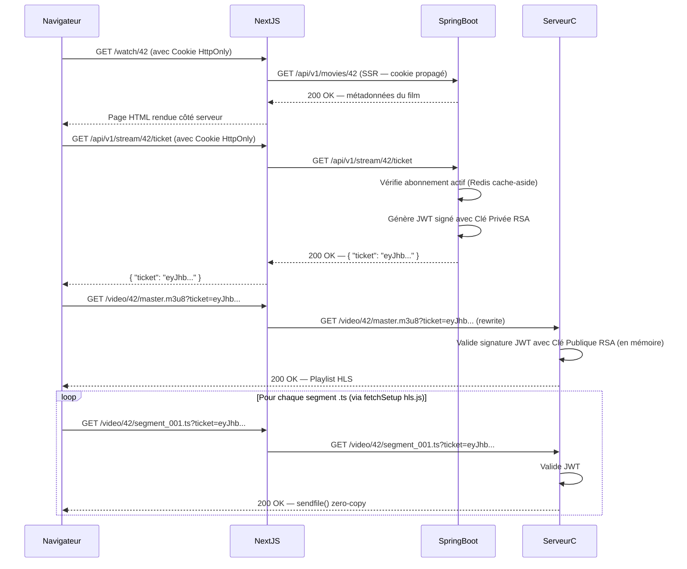

# 🎬 Netflix Clone

Clone de plateforme de streaming vidéo — monorepo full-stack avec authentification stateless, streaming HLS haute performance, et infrastructure conteneurisée.

**Stack :** Next.js 14 (TypeScript) · Spring Boot 3 (Java 21) · C++ (epoll/sendfile) · PostgreSQL · Redis · Docker · Terraform · Ansible

---

## 📑 Sommaire

- [Architecture globale](#-architecture-globale)
- [Modèle de données](#-modèle-de-données)
- [Flux d'authentification vidéo](#-flux-dauthentification-vidéo)
- [Structure du monorepo](#-structure-du-monorepo)
- [Setup initial](#-setup-initial)
- [Configuration (.env)](#-configuration-env)
- [Lancer le projet](#-lancer-le-projet)
- [Endpoints API](#-endpoints-api)
- [CI/CD](#-cicd)
- [Stratégie de branches](#-stratégie-de-branches)
- [Limitations connues](#-limitations-connues)

---

## 🏗️ Architecture globale

Next.js agit comme **reverse proxy unique** : le navigateur n'appelle jamais directement l'API (`:8080`) ou le moteur de streaming (`:8081`). `api-gateway` et `streaming-engine` partagent `app-network` avec `frontend-app` pour que les rewrites Next.js fonctionnent via les noms de service Docker. `postgres-db` et `redis-cache` vivent sur `db-network`, isolés du frontend.



### Ordre de démarrage recommandé

```
Clés RSA  →  Vidéo HLS  →  docker compose up (db + cache)  →  Backend  →  Moteur C++  →  Frontend
```

> Le CI s'écrit **après** que chaque service tourne en local, pas avant.

---

## 🗃️ Modèle de données

Schéma généré par Hibernate depuis les entités `@Entity` Spring Boot (pas de `schema.sql` maintenu à la main).



---

## 🔐 Flux d'authentification vidéo

Accès sécurisé et **stateless** à un segment vidéo : Spring Boot signe un ticket JWT avec sa clé privée RSA, le moteur C++ le valide uniquement avec la clé publique en mémoire — aucune communication à la volée entre les deux services.



---

## 📂 Structure du monorepo

```
netflix-clone/
├── .github/
│   └── workflows/
│       ├── ci-backend.yml        # Déclenché si backend/** modifié
│       ├── ci-frontend.yml       # Déclenché si frontend/** modifié
│       ├── ci-streaming.yml      # Déclenché si streaming/** modifié
│       └── ci-infra.yml          # Déclenché si infra/** ou docker-compose.yml modifié
├── backend/                      # API Spring Boot
│   ├── src/main/java/com/netflixclone/api/
│   │   ├── config/                # RedisConfig, SecurityFilterChain, CorsConfig
│   │   ├── controllers/           # AuthController, MovieController, ProfileController...
│   │   ├── models/                # Entités JPA : User, Profile, Movie, Genre...
│   │   ├── dtos/                  # MovieCardResponse, LoginRequest, TicketResponse...
│   │   ├── repositories/          # Interfaces Spring Data JPA
│   │   ├── security/              # JwtUtil, JwtAuthenticationFilter, RateLimitingFilter
│   │   └── services/              # AuthService, MovieService, StreamingService...
│   ├── src/main/resources/
│   │   ├── application.yml        # Config DB, Redis, JWT, ddl-auto: create-drop
│   │   └── data.sql               # Seeding (exécuté après création des tables par Hibernate)
│   ├── Dockerfile                 # Multi-stage : Maven build → JRE runtime
│   └── pom.xml
├── frontend/                     # UI Next.js (App Router, TypeScript)
│   ├── src/app/
│   │   ├── (auth)/login/page.tsx
│   │   ├── profiles/page.tsx
│   │   ├── browse/page.tsx
│   │   └── watch/[movieId]/page.tsx
│   ├── src/components/
│   │   ├── ui/                     # Button, Input, LoadingSpinner (shadcn/ui)
│   │   └── features/               # MovieCard, RowCarousel, HeroBanner, VideoPlayer...
│   ├── src/lib/
│   │   ├── apiClient.ts            # fetch client (credentials: 'include', X-Profile-Id)
│   │   └── serverApiClient.ts      # fetch SSR (propagation cookie via next/headers)
│   ├── src/middleware.ts           # Protection des routes → redirect /login
│   ├── Dockerfile
│   └── next.config.mjs             # Rewrites /api → Spring Boot, /video → moteur C++
├── streaming/                    # Moteur de streaming C++ (epoll, sendfile, JWT)
│   ├── include/                    # server.h, http_parser.h, jwt_validator.h...
│   ├── src/                        # server.cpp, http_parser.cpp, file_handler.cpp...
│   ├── Dockerfile                  # Multi-stage : GCC build → Alpine runtime
│   └── CMakeLists.txt
├── infra/                        # DevOps (aucun code applicatif)
│   ├── ansible/                    # inventory.ini, playbook.yml
│   ├── terraform/                  # main.tf, variables.tf, outputs.tf
│   └── secrets/                    # Clés RSA locales (.gitignore — jamais committées)
│       ├── private.pem
│       └── public.pem
├── media_library/                # Vidéos HLS locales (.gitignore)
├── .env                          # Variables d'environnement globales (.gitignore)
├── .env.example                  # Template à committer
├── docker-compose.yml            # Orchestrateur local global
└── README.md
```

---

## ⚙️ Setup initial

### 1. Génération des clés RSA

**À faire avant tout** — tous les services en dépendent (signature JWT côté Spring Boot, validation côté C++) :

```bash
openssl genrsa -out infra/secrets/private.pem 2048
openssl rsa -in infra/secrets/private.pem -pubout -out infra/secrets/public.pem
```

Ces fichiers ne sont **jamais committés** (couverts par `.gitignore`). Sans elles, les conteneurs démarrent mais la validation JWT échoue silencieusement.

### 2. Préparation de la vidéo (HLS)

Convertir une vidéo `.mp4` libre de droits (ex : Big Buck Bunny) en HLS avec FFmpeg :

```bash
mkdir -p media_library/big_buck_bunny
ffmpeg -i big_buck_bunny.mp4 \
  -codec: copy \
  -start_number 0 \
  -hls_time 5 \
  -hls_list_size 0 \
  -f hls \
  media_library/big_buck_bunny/master.m3u8
```

Résultat : `master.m3u8` + segments `*.ts`, montés dans le conteneur via `./media_library:/var/www/media:ro`.

### 3. Variables d'environnement

Copier le template et l'adapter :

```bash
cp .env.example .env
```

---

## 🔧 Configuration (.env)

```env
# Base de données
DB_USER=postgres
DB_PASSWORD=changeme

# Cache Redis
REDIS_PASSWORD=changeme

# JWT (durée en ms)
JWT_ACCESS_EXPIRATION=900000
JWT_REFRESH_EXPIRATION=604800000
```

> **Variables sans préfixe `NEXT_PUBLIC_`** (`API_INTERNAL_URL`, `STREAMING_URL`) : lues dynamiquement au démarrage du conteneur Next.js, pas injectées au build. En Docker → noms de service (`http://api-gateway:8080`) ; en dev local → `localhost`.

---

## 🚀 Lancer le projet

### Avec Docker Compose (recommandé)

```bash
# 1. Fondation : DB + cache
docker compose up postgres-db redis-cache

# 2. Vérifier les logs : "database system is ready to accept connections"

# 3. Ajouter l'API
docker compose up api-gateway

# 4. Tout lancer
docker compose up
```

### Réseaux Docker

| Réseau | Services | Rôle |
|---|---|---|
| `app-network` | `frontend-app`, `api-gateway`, `streaming-engine` | Permet aux rewrites Next.js (`/api/`, `/video/`) de fonctionner via les noms de service Docker |
| `db-network` | `postgres-db`, `redis-cache`, `api-gateway` | Isolé — la base de données n'est pas accessible depuis le frontend |

### Gestion du schéma de base de données

Hibernate génère le DDL depuis les entités `@Entity` (`ddl-auto: create-drop` en dev) — pas de `schema.sql` maintenu à la main pour éviter deux sources de vérité. `data.sql` reste dans `backend/src/main/resources/` pour le seeding initial, exécuté automatiquement par Spring Boot après la création des tables.

> Quand le projet est stable : générer le `schema.sql` définitif depuis Hibernate et passer à Flyway pour des migrations versionnées (`V1__init.sql`, ...).

---

## 🔗 Endpoints API

| Action frontend | Endpoint backend |
|---|---|
| Connexion | `POST /api/v1/auth/login` |
| Inscription | `POST /api/v1/auth/register` |
| Déconnexion | `POST /api/v1/auth/logout` |
| Rafraîchir le token | `POST /api/v1/auth/refresh` |
| Lister profils | `GET /api/v1/profiles` |
| Créer un profil | `POST /api/v1/profiles` |
| Catalogue tendances | `GET /api/v1/movies/trending` |
| Catalogue par genre | `GET /api/v1/movies/genre/{genreId}` |
| Détail film | `GET /api/v1/movies/{movieId}` |
| Liste des genres | `GET /api/v1/genres` |
| Ticket streaming | `GET /api/v1/stream/{movieId}/ticket` |
| Lire la watchlist | `GET /api/v1/watchlist` |
| Ajouter à la watchlist | `POST /api/v1/watchlist/{movieId}` |
| Retirer de la watchlist | `DELETE /api/v1/watchlist/{movieId}` |

**Sécurité :**
- Access Token & Refresh Token retournés dans des **Cookies HttpOnly**.
- Rate limiting sur `/login` et `/stream/{movieId}/ticket` : 5 tentatives / 60s par IP → `429 Too Many Requests`.
- Cache catalogue via `@Cacheable` Redis ; sessions de refresh token stockées `refreshToken:{userId}` avec TTL.

---

## 🔄 CI/CD

Un workflow GitHub Actions **par module**, déclenché uniquement si les fichiers du module concerné ont changé (filtre `paths:`).

| Workflow | Déclenché par | Étapes |
|---|---|---|
| `ci-backend.yml` | `backend/**` | `mvn test` → `docker build` |
| `ci-frontend.yml` | `frontend/**` | `npm ci` → `npm run lint` → `npm run build` → `docker build` |
| `ci-streaming.yml` | `streaming/**` | `cmake --build` → `docker build` |
| `ci-infra.yml` | `infra/**`, `docker-compose.yml` | `docker compose config` (validation syntaxe) |

**Quand écrire le CI :** après que la commande correspondante passe en local (`mvn test`, `npm run build`, `cmake --build`, `docker compose up`), jamais avant.

> **MVP :** le CI vérifie uniquement la compilation/tests + `docker build`. Le CD (push Docker Hub + redémarrage homelab) s'ajoute une fois que tout tourne en local — suffisant pour un portfolio d'alternance.

---

## 🌿 Stratégie de branches

```
main          ← code stable, toujours déployable (merge depuis dev uniquement)
└── dev       ← intégration quotidienne de toutes les features
    ├── feat/backend-auth
    ├── feat/frontend-player
    ├── feat/streaming-jwt
    ├── feat/infra-compose
    └── ...
```

**Convention de commits (Conventional Commits) :**

```
feat(backend): add refresh token endpoint
fix(frontend): correct cookie propagation in SSR
chore(infra): add healthcheck to postgres service
docs(readme): add RSA key generation instructions
```

---

## ⚠️ Limitations connues

- **Claim `ip` dans le ticket JWT :** empêche le partage de liens de streaming, mais les utilisateurs en 4G ou derrière un proxy peuvent changer d'IP en cours de lecture et recevoir un `403` inattendu. Comportement **intentionnel** pour le MVP.
- **`ddl-auto: create-drop`** recrée le schéma à chaque démarrage — à passer en `validate` + Flyway une fois le schéma stable.
- **Moteur C++ 100% stateless** : aucune dépendance Redis, aucun stockage du ticket côté backend — la signature RSA est l'unique source de vérité.
- **CORS sur le moteur C++ :** la requête preflight `OPTIONS` doit être gérée explicitement, sans quoi certains navigateurs (Firefox notamment, plus strict que Chrome) bloquent les requêtes HLS.

---

## 📦 Stack technique détaillée

| Module | Techno |
|---|---|
| Frontend | Next.js 14+ (App Router), TypeScript, Tailwind CSS, shadcn/ui, hls.js |
| Backend | Java 21, Spring Boot 3, Spring Data JPA, Spring Data Redis, Spring Security, `io.jsonwebtoken` |
| Streaming Engine | C++17/20, `epoll` (I/O non-bloquant), `jwt-cpp` + OpenSSL, HLS (FFmpeg) |
| Base de données | PostgreSQL 16 |
| Cache | Redis 7 |
| Conteneurisation | Docker & Docker Compose |
| CI/CD | GitHub Actions |
